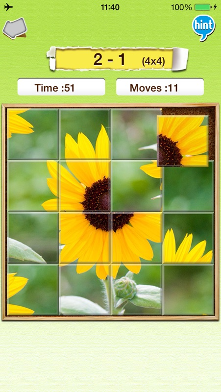
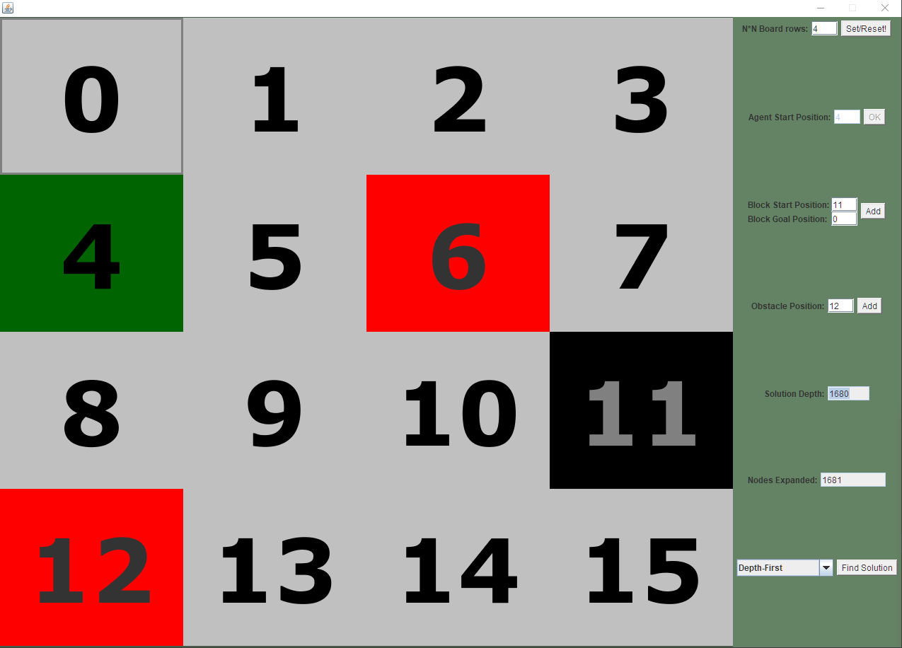
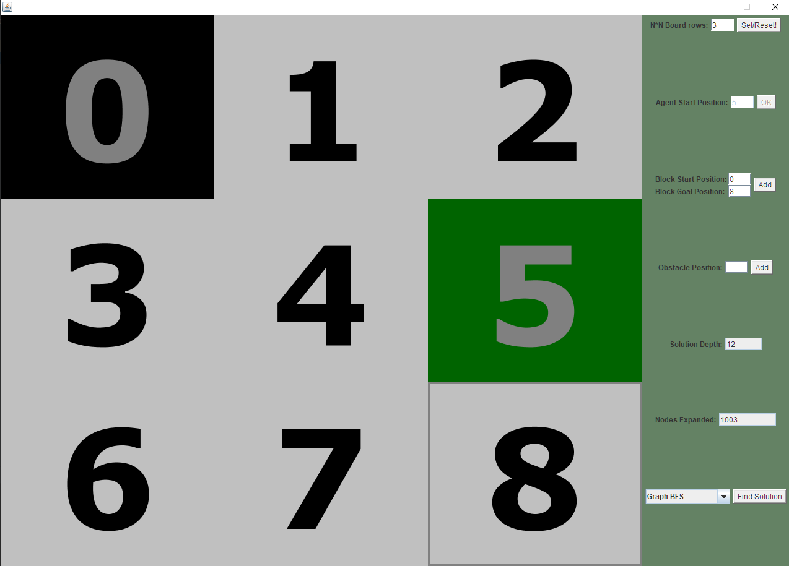
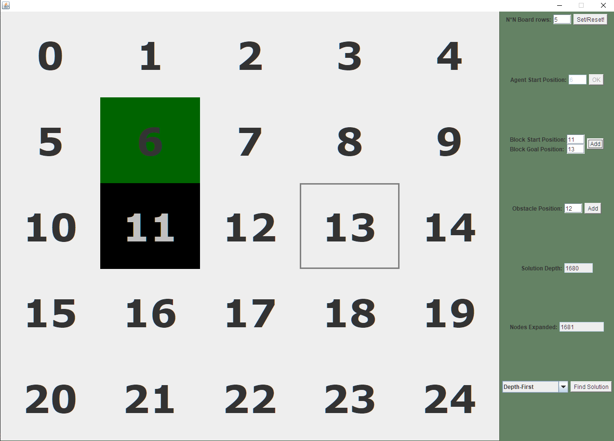

# Tile-swap puzzle solver


## Desccription
- Java Application that simulates the classig puzzle game and shows how to get a tile from point A to B.
- Users can chose between different treversal algorithms like **A***, **Breadth-First Search**, **Depth-First Search**, and their variations.
- Presents the number of actions needed for every algorithm to solve the puzzle. 
- The game board can be set to any NxN size
- There is a twist! Users can place immovable red blocks that the algorithms have to work around. Caution: it is possible to make the puzzle impossible this way. 

## Setup project locally
- Java 8
- Java FX


## Setup project locally

Run commands in a terminal:
```
javac PuzzleBoard.java

java PuzzleBoard
```

## Original Puzzle And Pictures







